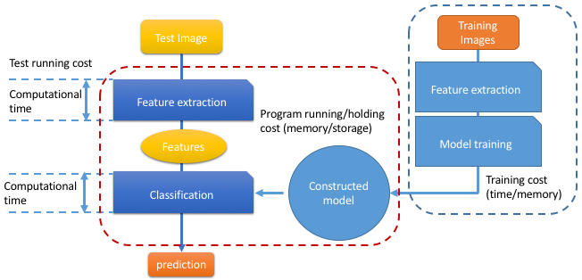

# Project: Can you recognize the emotion from an image of a face? 

(Image source: https://www.pnas.org/content/111/15/E1454)

### [Full Project Description](doc/project3_desc.md)

Term: Fall 2020

+ Project 3 Team 2
+ Team members
	+ Tianle Zhu 
	+ Zhenglei Chen 
	+ Mingzhi Zhang 
	+ Luyao Sun
	+ Mina Jiang 

+ **Project summary**: In this project, we created a classification engine for facial emotion recognition. We implemented a Gradient Boosting Machine (GBM) to train a baseline model on 3000 facial images with the extracted features to recognize the emotion from new facial images. Before the modeling, we did data preprocessing. Due to the fact that our data contains high dimensional features, we used Principal component analysis (PCA) to reduce the dimensional data by selecting the most important principal components that capture maximum information. Moreover, our data is imbalanced, so we tried the oversampling technique such as the weighted and smote method to deal with the issue. For the modeling, we tried several models(SVM, VGG16, KNN, Random Forest) and according to the accuracy, AUC score, training time, and testing time, we found SVM improve the baseline model the most. 


+ **Project Results**: The following table is our model results. 
  + Comparing to other models, SVM achieve the highest accuracy 82.67% and AUC score 82.77% in the testing data. Thus, we choose SVM model as our advanced model.


   

+ **Contribution statement**: ([default](doc/a_note_on_contributions.md)) All team members contribute to this project. All team members approve our work presented in this GitHub repository including this contributions statement. 
  + Tianle Zhu: 
  + Zhenglei Chen: 
  + Mingzhi Zhang:
  + Luyao Sun:
  + Mina Jiang: 

Following [suggestions](http://nicercode.github.io/blog/2013-04-05-projects/) by [RICH FITZJOHN](http://nicercode.github.io/about/#Team) (@richfitz). This folder is orgarnized as follows.

```
proj/
├── lib/
├── data/
├── doc/
├── figs/
└── output/
```

Please see each subfolder for a README file.
